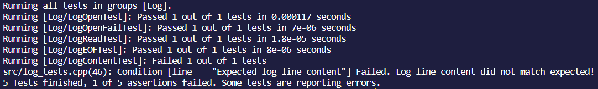

# Internet of Things (IoT)

This project is designed to introduce fundamental concepts of IoT systems, focusing on log file processing and testing methodologies. It is structured into three main tasks, each building upon the previous to enhance the project's functionality and robustness.

## Getting Started

These instructions will help you get a copy of the project up and running on your local machine for development and testing purposes.

### Prerequisites

- C++17 compatible compiler (e.g., `g++` or `clang++`)
- Make (for building the project)
- SimpleTest framework (included as a submodule)

### Installing

1. Clone the repository and navigate into the project directory:
    ~~~bash
    https://github.com/AhmadTNofal/Log-File-Processing.git
    cd iot_starter
    ~~~

2. Initialize and update the SimpleTest submodule:
    ~~~bash
    git submodule init
    git submodule update
    ~~~
3. Selecting a task:
    ~~~bash
    # Task 1
    cd Task1
    # Task 2
    cd Task2
    # Task 3
    cd Task3
    ~~~

4. Build the project using `make`:
    ~~~bash
    make
    ~~~
 

## Task 1: Basic Log Processing

The first task introduces a simple C++ application that processes log files. The application reads log entries from a file and displays their content.

### Features

- Reading log entries from a file.
- Displaying log content to the console.
- Task 1 is Built on three different parts

### Usage
- Select part:
    ~~~bash
    # Part 1
    cd part1
    # Part 2
    cd part2
    # Part 3
    cd part3
    ~~~
- Run the application with:

    #### Make
    ~~~bash
    make
    ~~~

    #### Build
    ~~~ bash
    ./build/app
    ~~~

## Part 1
#### Function:
~~~c++
std::string line(const std::string& logLine) {
    size_t startPos = logLine.find(": ") + 2; // Find the start of the message just after ": "
    if (startPos != std::string::npos) {
        return logLine.substr(startPos); // Extract the message part
    }
    return ""; // Return an empty string if the format is incorrect
}
~~~
#### Expected Output:
~~~
=> "Invalid operation"
~~~

 

## Part 2
#### Function:
~~~c++
std::string level(const std::string& logLine) {
    size_t start = logLine.find('[') + 1;
    size_t end = logLine.find(']');

    if (start != std::string::npos && end != std::string::npos && end > start) {
        std::string logLevel = logLine.substr(start, end - start);
        // Convert to uppercase
        std::transform(logLevel.begin(), logLevel.end(), logLevel.begin(),  { return std::toupper(c); });
        return logLevel;
    }
    return ""; // Return an empty string if the format is incorrect
}
~~~
#### Expected Output:
~~~
=> "ERROR"
~~~
## Part 3
#### Function:
~~~c++
std::string reformat(const std::string& logLine) {
    size_t start = logLine.find('[') + 1;
    size_t end = logLine.find(']');
    size_t messageStart = logLine.find(": ") + 2;

    if (start != std::string::npos && end != std::string::npos && messageStart != std::string::npos) {
        std::string logLevel = logLine.substr(start, end - start);
        std::string message = logLine.substr(messageStart);

        return message + " (" + logLevel + ")";
    }
    return ""; // Return an empty string if the format is incorrect
}
~~~
#### Expected Output:
~~~
=> "Operation completed (INFO)"
~~~

 

# Task 2: Advanced Log Processing and Testing
- Building on Task 1, this task enhances the log processing application with advanced features, by introducing log functionalities.
- Showing all the parts from task 1 mereged into one using log.hpp and log.cpp and running them in the main.cpp.

## Features
- **Advanced Log Processing:** Implements sophisticated log file parsing and data extraction techniques to handle complex log formats.

## Files
- <code style="color : lightGreen">log.hpp</code>
- <code style="color : lightGreen">log.cpp</code>
- <code style="color : lightGreen">main.cpp</code>

## Usage

#### Make
~~~bash
make
~~~

#### Build
~~~ bash
./build/app
~~~
 

## Functionality

#### How the funtions work through log.hpp and log.cpp:
~~~c++
#include "log.hpp"
#include <iostream>

int main() {
    Log log;

    // Process each log entry in the file
    while (log.next()) {
        std::string reformatted = log.reformat();  // Get the reformatted log entry
        std::string line = log.line();             // Get the log message
        std::string level = log.level();           // Get the log level

        //Print the reformatted log entry, original log message, and log level
        std::cout << reformatted << std::endl;
        std::cout << line << std::endl;
        std::cout << level << std::endl;
    }

    return 0;
}
~~~
#### Expected Output:
~~~
=> "Invalid operation (ERROR)"
=> "Invalid operation"
=> "ERROR"
~~~

 

# Task 3: Comprehensive Testing and Error Handling
This task extends the testing framework established in Task 2 and improves the application's robustness by implementing comprehensive error handling mechanisms.

## Features
- Comprehensive Testing: Expands the test suite to cover edge cases and less common scenarios, ensuring the application can handle a wide range of inputs and situations.
- Error Handling: Enhances the application's resilience by implementing robust error handling strategies, preventing crashes and undefined behavior in the face of unexpected conditions.
## Running Tests
Execute the following command to compile and run the unit tests:

~~~bash
make test
~~~
This command builds the test suite and executes tests, reporting any failures and ensuring that all components behave as expected.

## Running Enhanced Tests
To run the comprehensive test suite, use the command:

~~~bash
./build/log_tests
~~~
This will execute an extended series of tests, providing detailed output on each test's status and highlighting any areas that require attention.

 

## Tests
#### 1. Test 1:
~~~c++
// Test 1: Successfully opening a log file
DEFINE_TEST_G(LogOpenTest, Log) {
    Log log;
    bool success = log.create_log("log.in");
    TEST_MESSAGE(success == true, "Failed to open log file!");
}
~~~

 

#### 2. Test 2:
~~~c++
// Test 2: Fail to open a non-existent log file
DEFINE_TEST_G(LogOpenFailTest, Log) {
    Log log;
    bool success = log.create_log("nonexistent_log.in");
    TEST_MESSAGE(success == false, "Should fail to open a non-existent log file!");
}
~~~

 

#### 3. Test 3:
~~~c++
// Test 3: Successfully read a line from the log file
DEFINE_TEST_G(LogReadTest, Log) {
    Log log;
    log.create_log("log.in");
    bool success = log.next();
    TEST_MESSAGE(success == true, "Failed to read a line from the log file!");
}
~~~

 

#### 4. Test 4:
~~~c++
// Test 4: Reach the end of the log file
DEFINE_TEST_G(LogEOFTest, Log) {
    Log log;
    log.create_log("log.in");
    while (log.next()); // Read until the end
    TEST_MESSAGE(!log.next(), "Did not reach the end of the log file as expected!");
}
~~~

 

#### 5. Test 5:
~~~c++
// Test 5: Verify the content of the log line
DEFINE_TEST_G(LogContentTest, Log) {
    Log log;
    log.create_log("log.in");
    log.next(); // Assuming the first line is what we want to test
    string line = log.line();
    TEST_MESSAGE(line == "Expected log line content", "Log line content did not match expected!");
}
~~~
 

### Output From Tests:

 

# Additional Instructions:
- Ensure that all prerequisites are met before running the tests, including any required setup or configuration.
- Review the test output carefully to identify and resolve any issues that may arise, ensuring the log processing application is reliable and robust under various conditions.
